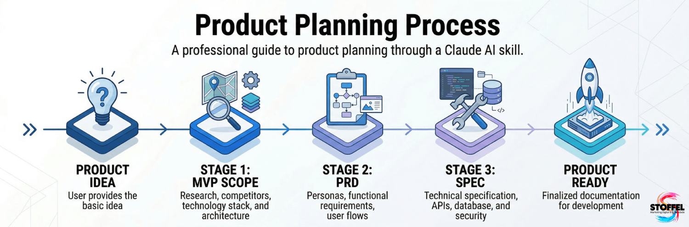

<p align="center">
    
</p>

<hr/>

# Istofel Project Plan

A professional Claude skill that guides you through the complete product planning process — from raw idea to implementation-ready documentation — in three structured steps: **MVP Scope → PRD → SPEC**.

Each document is generated one at a time. Claude asks for your confirmation before moving to the next step, ensuring you review and approve each phase before proceeding.

---

## What It Does

Given a product idea, this skill produces three professional technical documents:

| Document | Purpose |
|----------|---------|
| **MVP Scope** | Market research, competitive landscape, recommended tech stack, architecture overview, data model preview, business rules, monetization, feature roadmap, and risks |
| **PRD** | Design principles, personas, use case map, functional requirements with typed business rules, UI states, ASCII layout, user flows, feature specification, data schema, sprint roadmap, and global acceptance criteria |
| **SPEC** | ADRs, module-by-module technical specification with typed signatures, critical logic, state machines, domain invariants, build sequence with checkpoints, sequence diagrams, DB schema with constraints, API contracts, error hierarchy, security, observability, test strategy, and CI/CD pipeline |

---

## Installation

### 1. Clone the repository

```bash
git clone https://github.com/istofel/istofel-project-plan.git
cd istofel-project-plan
```

### 2. Download the ZIP

On the repository page, click **Code → Download ZIP**.

### 3. Install in Claude

1. Open [Claude.ai](https://claude.ai) or Claude Code
2. Go to **Settings → Skills**
3. Click **Upload a skill**
4. Select the Downloaded ZIP **istofel-project-plan-main.zip** `istofel-project-plan/`

---

## How to Use

### Step 1 — Start with your idea

Trigger the skill by describing your product. You can be as brief or detailed as you like. The skill will ask clarifying questions if critical information is missing.

**Example prompt:**

```
I want to build a mobile app that helps freelancers track their working hours and 
generate invoices automatically. Target users are designers and developers who work 
for multiple clients. I want to charge a monthly subscription.
```

**Or even just:**

```
Help me plan a SaaS for restaurant inventory management.
```

Claude will ask up to 5 focused questions if anything critical is missing (target audience, monetization model, distribution platform, tech constraints), then generate the MVP Scope.

---

### Step 2 — Review the MVP Scope

Claude generates the full MVP Scope document covering:

- Product vision and value proposition
- Market size and competitive landscape
- Recommended tech stack with trade-offs
- Architecture overview (ASCII diagram)
- Data model preview
- Core business rules
- Feature roadmap (Essential MVP / Post-MVP v1 / Future)
- Monetization model
- Risks and out-of-scope items
- Executive summary

After reviewing, Claude asks:

> *"Would you like to proceed to the PRD?"*

Reply **yes** to continue or request changes first.

---

### Step 3 — Review the PRD

Claude generates the full PRD covering:

- Design principles
- Personas with use case map
- Functional requirements with acceptance criteria, typed business rules, and error handling
- Non-functional requirements
- ASCII layout of the main interface
- Screen states (offline, empty, loading, error, ready)
- User flows as pseudoflowcharts (onboarding, happy path, etc.)
- Feature specification with components, typed rules, and MVP limitations
- Complete data schema with indexes and migration strategy
- Sprint roadmap
- Global acceptance criteria (binary definition of done)
- Risks, out-of-scope, and glossary

> ⚠️ The PRD contains **no mentions of libraries, frameworks, languages, or infrastructure**. Those decisions belong in the SPEC. Mixing product rules with technical decisions causes the agent to treat revisable choices as immutable business rules.

After reviewing, Claude asks:

> *"Would you like to proceed to the SPEC?"*

---

### Step 4 — Review the SPEC

Claude generates the full SPEC covering:

- **ADRs (Architecture Decision Records)** — each significant technical decision documented with context, decision, rationale, and consequences; the agent treats ADRs as closed decisions and does not revisit them
- Architecture diagram with layers and protocols
- Project directory tree with per-file responsibility
- Global constants and environment variables
- Module-by-module specification (typed signatures, critical logic, framework notes)
- Session state documentation
- Complete SQL schema with CHECK constraints and migration strategy
- **State machines and domain invariants** — for entities with complex lifecycles: state transitions with side effects, terminal states, and four types of invariants (Invariant, Validation, State Transition, Authorization)
- **Build sequence** — numbered linear steps with concrete implementation items and mandatory validation checkpoints; the agent must not advance to the next step without confirming the previous one works
- API contracts (internal endpoints + external APIs consumed)
- Error hierarchy with UI handling per exception type
- Security checklist (sanitization, rate limiting, secrets management)
- Observability (logging format, metrics, alerts)
- Test strategy with fixtures, critical tests per module, and coverage targets
- Sequence diagrams for critical flows
- CI/CD pipeline and environments

---

## Tips for Best Results

### Provide context upfront

The more context you give initially, the fewer clarifying questions Claude needs to ask. Ideal input covers:

| Information | Example |
|-------------|---------|
| **What it does** | "A local AI assistant that runs fully offline" |
| **Who uses it** | "Python developers who want privacy" |
| **Core problem** | "Existing tools require cloud APIs or Docker" |
| **Distribution** | "pip install, desktop app, web SaaS, mobile" |
| **Monetization** | "Free/open-source, freemium, monthly subscription" |
| **Tech constraints** | "Must be Python, team of 1, no paid infra" |
| **Key features** | "Chat, file upload, conversation history, metrics" |

### Review before proceeding

Each document builds on the previous one. If something is wrong in the MVP Scope (wrong stack choice, incorrect target audience), it will propagate to the PRD and SPEC. Take time to review each step.

### Request changes before moving on

You can ask Claude to revise any section before confirming to proceed. For example:

```
Before we move to the PRD, please revise the tech stack section — 
I want to use FastAPI instead of Django, and PostgreSQL instead of SQLite.
```

### The skill flags what you forgot

Throughout all three documents, Claude proactively signals omitted but important items with:

> 💡 **Suggestion:** [explanation of what was missed and why it matters]

These cover: data retention policy, LGPD/GDPR compliance, observability setup, i18n, accessibility (WCAG), test strategy, license definition, rollback strategy for third-party dependencies.

---

## Document Examples

### MVP Scope — excerpt

```markdown
## 3. Recommended Tech Stack

| Layer       | Choice         | Alternative   | Trade-off                                      |
|-------------|----------------|---------------|------------------------------------------------|
| Backend     | FastAPI        | Django        | FastAPI is lighter and async-native; Django has more batteries |
| Database    | SQLite         | PostgreSQL    | SQLite needs zero infra; migrate to Postgres at 10k+ users |
| Auth        | JWT (PyJWT)    | Auth0         | JWT is self-contained; Auth0 adds cost but saves implementation time |
| Deploy      | Railway        | Fly.io        | Railway is simpler for solo devs; Fly gives more control |

**Premise:** Single-developer team. No existing infrastructure.

## 9. Feature Roadmap

| Feature              | Priority       | Complexity | Dependencies     |
|----------------------|----------------|------------|------------------|
| User auth (JWT)      | Essential MVP  | Medium     | —                |
| Dashboard overview   | Essential MVP  | Medium     | Auth             |
| Invoice generation   | Essential MVP  | High       | Dashboard        |
| PDF export           | Post-MVP v1    | Medium     | Invoice          |
| Stripe integration   | Post-MVP v1    | High       | Invoice          |
| Mobile app           | Future         | High       | API stable       |
```

---

### PRD — excerpt

```markdown
## RF-03: Invoice Generation

**Description:** The system must allow users to generate invoices from tracked time entries.

**Acceptance criteria:**
- User selects a client and a date range
- System calculates total hours and applies the configured hourly rate
- Invoice is rendered with line items, subtotal, taxes, and total
- User can edit line items before finalizing
- Finalized invoice receives a sequential number and is locked for editing

**Rules:**
- Hourly rate defaults to the client's configured rate; can be overridden per invoice | Type: Validation
- Tax rate is configured per user account (default: 0%) | Type: Invariant
- Invoice number format: `INV-{YEAR}-{SEQUENCE}` (e.g., INV-2026-0042) | Type: Invariant
- Only the invoice owner can delete a draft invoice | Type: Authorization
- Invoice transitions from `draft` to `finalized` when the user confirms; once finalized, editing is locked | Type: State Transition

**Error handling:**
- No time entries in selected range → show empty state with CTA to log hours
- Client has no hourly rate configured → show inline warning before generation

---

## 6.3 Screen States

| State      | Trigger                    | What appears                                      |
|------------|----------------------------|---------------------------------------------------|
| Empty      | No invoices yet            | Illustration + "Generate your first invoice" CTA  |
| Loading    | Fetching invoice list      | Skeleton rows                                     |
| Ready      | Data loaded                | Invoice list with filters                         |
| Error      | API failure                | Banner: "Could not load invoices. Try again."     |
```

---

### SPEC — excerpt

```markdown
## 2. ADRs — Architecture Decision Records

ADR-01: FastAPI as backend framework
  Context:  Need async-native Python framework; team is familiar with Python.
            Evaluated Django REST Framework and Flask.
  Decision: FastAPI over Django REST Framework.
  Motivo:   Native async support, automatic OpenAPI docs, Pydantic validation
            built-in. Django adds ORM and admin overhead not needed here.
  Consequences: Follow FastAPI dependency injection patterns.
                Do not use Django ORM or Flask blueprints.

---

## 8. State Machines and Domain Invariants

### Invoice — State Machine

States: draft | finalized | cancelled

Transitions:
  draft ── user confirms ──→ finalized
      side effect: invoice number assigned, editing locked

  draft ── user discards ──→ cancelled
      side effect: line items soft-deleted

  finalized ── admin voids ──→ cancelled
      side effect: credit note generated

Terminal states: cancelled — no further transitions allowed

### Domain Invariants

INV-01: [Invariant]
  A finalized invoice always has a non-null, unique invoice number.
  Verify in: invoice repository save() — assert before commit

INV-02: [Validation]
  An invoice can only be finalized if it has at least one line item with hours > 0.
  Verify in: InvoiceService.finalize() — check before state transition

INV-03: [State Transition]
  Invoice moves from draft to finalized when user confirms; editing is locked immediately.
  Side effect: sequential number assigned atomically.
  Verify in: domain state machine — never allow attribute mutation after finalization

INV-04: [Authorization]
  Only the invoice owner or an admin can cancel a finalized invoice.
  Verify in: authorization middleware — before reaching InvoiceService

---

## 9. Build Sequence

STEP 1: Project setup and directory structure
  What to implement:
    - Initialize repo, install dependencies, configure linter and formatter
    - Create src/ structure per section 3
  Validation checkpoint (must pass before advancing):
    - App starts without errors
    - Linter passes with zero warnings
  Dependencies: none

STEP 2: Database and migrations
  What to implement:
    - Define full schema per section 7
    - Run initial migration, verify tables and indexes
  Validation checkpoint:
    - All tables created, foreign keys enforced
    - Migration is idempotent (safe to run twice)
  Dependencies: Step 1

STEP 3: Core business logic
  What to implement:
    - InvoiceService, TimeEntryRepository with typed signatures
    - Domain invariants INV-01 through INV-04
  Validation checkpoint:
    - Unit tests for all invariants pass
    - 80% coverage on core/
  Dependencies: Step 2
```

---

## Repository Structure

```
istofel-project-plan/
├── SKILL.md                        # Main skill logic, flow, triggers, proactive rules
└── references/
    ├── mvp-scope.md                # Complete MVP Scope structure and checklist
    ├── prd.md                      # Complete PRD structure and checklist
    └── spec.md                     # Complete SPEC structure and checklist (21 sections)
```

---

## License

MIT License — Copyright (c) 2026 Vinícius Istofel Oliveira.

See [LICENSE](LICENSE) for full text.
