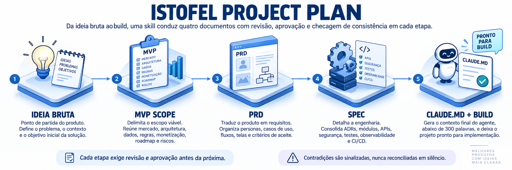

<p align="center">
    
</p>

<hr/>

# Istofel Project Plan

Skill profissional para Claude que conduz todo o processo de planejamento de produto — da ideia bruta à documentação pronta para implementação — em quatro etapas estruturadas: **MVP Scope → PRD → SPEC → CLAUDE.md**.

Cada documento é gerado um por vez. Claude pede sua confirmação antes de avançar para a próxima etapa, garantindo que você revise e aprove cada fase antes de prosseguir.

Antes de entregar cada documento, Claude o confronta com os já aprovados e sinaliza qualquer contradição — uma stack divergente do MVP Scope, um endpoint que viola regra de autorização do PRD, um passo de build implementando feature fora de escopo. Contradições são apresentadas para você resolver, nunca reconciliadas em silêncio.

---

## O Que Faz

A partir de uma ideia de produto, esta skill produz quatro documentos técnicos profissionais:

| Documento | Finalidade |
|-----------|-----------|
| **MVP Scope** | Pesquisa de mercado, cenário competitivo, stack tecnológica recomendada, visão geral da arquitetura, prévia do modelo de dados, regras de negócio, monetização, roadmap de features e riscos |
| **PRD** | Princípios de design, personas, mapa de casos de uso, requisitos funcionais com regras de negócio tipadas, estados de tela, layout em ASCII, user flows, especificação de features, schema de dados, roadmap por sprint e critérios de aceite globais |
| **SPEC** | ADRs, especificação técnica módulo a módulo com assinaturas tipadas, lógica crítica, máquinas de estado, invariantes de domínio, sequência de build com checkpoints, diagramas de sequência, schema de banco com constraints, contratos de API, hierarquia de erros, segurança, observabilidade, estratégia de testes e pipeline CI/CD |
| **CLAUDE.md** | Arquivo de contexto personalizado para o agente de IA, gerado automaticamente a partir dos três documentos anteriores: comandos de desenvolvimento, stack fixada com referência a ADRs, estrutura de diretórios, design tokens, invariantes de domínio, sequência de build, variáveis de ambiente, casos extremos, glossário e regras de execução. Abaixo de 300 palavras, pronto para colocar na raiz do repositório |

---

## Instalação

### 1. Clone o repositório

```bash
git clone https://github.com/istofel/istofel-project-plan.git
cd istofel-project-plan
```

### 2. Baixe o ZIP

Na página do repositório, clique em **Code → Download ZIP**.

### 3. Instale no Claude

1. Abra o [Claude.ai](https://claude.ai) ou o Claude Code
2. Vá em **Settings → Skills**
3. Clique em **Upload a skill**
4. Selecione o ZIP baixado **istofel-project-plan-main.zip** `istofel-project-plan/`

---

## Como Usar

### Etapa 1 — Comece com sua ideia

Acione a skill descrevendo seu produto. Pode ser breve ou detalhado. A skill fará perguntas de esclarecimento se faltar alguma informação crítica.

**Exemplo de prompt:**

```
Quero construir um app mobile que ajuda freelancers a controlar suas horas 
trabalhadas e gerar faturas automaticamente. O público são designers e 
desenvolvedores que atendem vários clientes. Quero cobrar assinatura mensal.
```

**Ou simplesmente:**

```
Me ajuda a planejar um SaaS de controle de estoque para restaurantes.
```

Claude fará no máximo 5 perguntas focadas se algo crítico estiver faltando (público-alvo, modelo de monetização, plataforma de distribuição, restrições técnicas) e então gerará o MVP Scope.

---

### Etapa 2 — Revise o MVP Scope

Claude gera o documento completo de MVP Scope cobrindo:

- Visão do produto e proposta de valor
- Tamanho de mercado e cenário competitivo
- Stack tecnológica recomendada com trade-offs
- Visão geral da arquitetura (diagrama ASCII)
- Prévia do modelo de dados
- Regras de negócio centrais
- Roadmap de features (Essencial MVP / Pós-MVP v1 / Futuro)
- Modelo de monetização
- Riscos e itens fora de escopo
- Resumo executivo

Após a revisão, Claude pergunta:

> *"Deseja prosseguir para o PRD?"*

Responda **sim** para continuar ou peça alterações antes.

---

### Etapa 3 — Revise o PRD

Claude gera o PRD completo cobrindo:

- Princípios de design
- Personas com mapa de casos de uso
- Requisitos funcionais com critérios de aceite, regras de negócio tipadas e tratamento de erros
- Requisitos não-funcionais
- Layout em ASCII da interface principal
- Estados de tela (offline, vazio, carregando, erro, pronto)
- User flows como pseudofluxogramas (onboarding, happy path, etc.)
- **Estados por ação** — para cada ação do usuário: gatilho, validação, loading, sucesso, erro e destino
- Especificação de features com componentes, regras tipadas e limitações do MVP
- Schema de dados completo com índices e estratégia de migração
- Roadmap por sprint
- Critérios de aceite globais (definition of done binária)
- Riscos, fora de escopo e glossário

> ⚠️ O PRD **não contém nenhuma menção a bibliotecas, frameworks, linguagens ou infraestrutura**. Essas decisões pertencem à SPEC. Misturar regras de produto com decisões técnicas faz o agente tratar escolhas revisáveis como regras imutáveis de negócio.

Após a revisão, Claude pergunta:

> *"Deseja prosseguir para a SPEC?"*

---

### Etapa 4 — Revise a SPEC

Claude gera a SPEC completa cobrindo:

- **ADRs (Architecture Decision Records)** — cada decisão técnica relevante documentada com contexto, decisão, motivo e consequências; o agente trata ADRs como decisões fechadas e não as revisita
- Diagrama de arquitetura com camadas e protocolos
- Árvore de diretórios do projeto com responsabilidade por arquivo
- **Comandos de desenvolvimento** — comandos literais para setup, servidor de dev, build, lint, testes e migrações
- Constantes globais e variáveis de ambiente
- **Design tokens** — cores exatas da marca, cores semânticas, tipografia, escala de espaçamento (omitido em produtos CLI/API)
- Especificação módulo a módulo (assinaturas tipadas, lógica crítica, notas de framework)
- Documentação do estado de sessão
- Schema SQL completo com CHECK constraints e estratégia de migração
- **Máquinas de estado e invariantes de domínio** — para entidades com ciclo de vida complexo: transições com efeitos colaterais, estados terminais e quatro tipos de invariante (Invariante, Validação, Transição de Estado, Autorização)
- **Sequência de build** — passos lineares numerados, dimensionados para caber em uma única sessão (≤5 arquivos, ≤200 linhas), cada um com checkpoint exigindo evidência concreta (um comando e seu resultado esperado), nunca avaliação subjetiva; o agente não avança sem confirmar que o passo anterior funciona
- Contratos de API (endpoints internos + APIs externas consumidas)
- Hierarquia de erros com tratamento na UI por tipo de exceção
- Checklist de segurança (sanitização, rate limiting, gestão de secrets)
- Observabilidade (formato de log, métricas, alertas)
- Estratégia de testes com fixtures, testes críticos por módulo e metas de cobertura
- Diagramas de sequência para fluxos críticos
- Pipeline CI/CD e ambientes

Após a revisão, Claude pergunta:

> *"Deseja prosseguir para o CLAUDE.md?"*

---

### Etapa 5 — Revise o CLAUDE.md

Claude gera um `CLAUDE.md` personalizado automaticamente — sem perguntas adicionais. Todo valor é extraído dos três documentos anteriores, nunca inventado.

O `CLAUDE.md` gerado cobre:

- **Visão geral do projeto** — nome, descrição em uma linha, stack, caminhos para os três documentos
- **Comandos de desenvolvimento** — comandos literais para setup, dev, build, lint, format, testes e migrações, prontos para rodar
- **Padrões obrigatórios de código** — convenções da linguagem, nomes de arquivo, formato de IDs e timestamps, classe base de exceções, padrões de acesso a banco e API
- **O que NUNCA fazer** — proibições explícitas, cada uma rastreada ao ADR ou invariante que a origina, mais uma instrução permanente de registrar correções sempre que o agente cometer um erro
- **Stack e versões fixadas** — com referência aos ADRs; o agente trata como decisões fechadas e não propõe alternativas
- **Estrutura de diretórios** — pastas de primeiro nível com responsabilidade, para o agente saber onde criar cada arquivo
- **Design tokens** — cores da marca e semânticas, fontes, escala de espaçamento (omitido em produtos CLI, API ou biblioteca)
- **Invariantes críticas de domínio** — cada INV-XX em formato compacto com seu tipo e onde verificar no código
- **Sequência de build** — passos com checkpoints, mais um campo de passo atual para o desenvolvedor acompanhar o progresso
- **Variáveis de ambiente** — nome, padrão e se é obrigatória
- **Casos extremos respondidos** — situações que o agente implementaria errado sem essa orientação
- **Glossário do domínio** — o termo a usar no código versus os que devem ser evitados
- **Regras de execução** — seção fixa em todo arquivo gerado: toque apenas no que o pedido exige, nunca refatore código adjacente, remova só os órfãos que suas próprias mudanças criaram, declare ambiguidade em vez de adivinhar, apresente múltiplas interpretações em vez de escolher em silêncio

O arquivo é mantido abaixo de 300 palavras. Como o Claude Code o carrega no início de cada sessão, cada token que ele consome é gasto antes mesmo de você digitar seu prompt — por isso ele carrega apenas o que muda o comportamento do agente.

Coloque o `CLAUDE.md` na raiz do repositório do seu projeto.

---

## Dicas para Melhores Resultados

### Forneça contexto desde o início

Quanto mais contexto você der inicialmente, menos perguntas de esclarecimento Claude precisa fazer. Uma entrada ideal cobre:

| Informação | Exemplo |
|------------|---------|
| **O que faz** | "Um assistente de IA local que roda totalmente offline" |
| **Quem usa** | "Desenvolvedores Python que querem privacidade" |
| **Problema central** | "Ferramentas existentes exigem APIs na nuvem ou Docker" |
| **Distribuição** | "pip install, app desktop, SaaS web, mobile" |
| **Monetização** | "Gratuito/open-source, freemium, assinatura mensal" |
| **Restrições técnicas** | "Tem que ser Python, time de 1 pessoa, sem infra paga" |
| **Features principais** | "Chat, upload de arquivo, histórico de conversas, métricas" |

### Revise antes de prosseguir

Cada documento se apoia no anterior. Se algo estiver errado no MVP Scope (escolha de stack equivocada, público-alvo incorreto), isso vai se propagar para o PRD, a SPEC e o CLAUDE.md. Reserve tempo para revisar cada etapa.

### Peça alterações antes de avançar

Você pode pedir que Claude revise qualquer seção antes de confirmar a continuação. Por exemplo:

```
Antes de irmos para o PRD, revise a seção de stack tecnológica — 
quero usar FastAPI em vez de Django, e PostgreSQL em vez de SQLite.
```

### A skill sinaliza o que você esqueceu

Ao longo de todos os documentos, Claude sinaliza proativamente itens omitidos mas importantes com:

> 💡 **Sugestão:** [explicação do que faltou e por que importa]

Isso cobre: política de retenção de dados, conformidade com LGPD/GDPR, configuração de observabilidade, internacionalização, acessibilidade (WCAG), estratégia de testes, definição de licença e estratégia de rollback para dependências de terceiros.

---

## Exemplos de Documentos

### MVP Scope — trecho

```markdown
## 3. Stack Tecnológica Recomendada

| Camada      | Escolha        | Alternativa   | Trade-off                                      |
|-------------|----------------|---------------|------------------------------------------------|
| Backend     | FastAPI        | Django        | FastAPI é mais leve e async-native; Django traz mais baterias inclusas |
| Banco       | SQLite         | PostgreSQL    | SQLite dispensa infra; migrar para Postgres a partir de 10k usuários |
| Auth        | JWT (PyJWT)    | Auth0         | JWT é autocontido; Auth0 custa mas poupa tempo de implementação |
| Deploy      | Railway        | Fly.io        | Railway é mais simples para dev solo; Fly dá mais controle |

**Premissa:** Time de um único desenvolvedor. Sem infraestrutura existente.

## 9. Roadmap de Features

| Feature                 | Prioridade      | Complexidade | Dependências     |
|-------------------------|-----------------|--------------|------------------|
| Autenticação (JWT)      | Essencial MVP   | Média        | —                |
| Dashboard geral         | Essencial MVP   | Média        | Auth             |
| Geração de faturas      | Essencial MVP   | Alta         | Dashboard        |
| Exportação em PDF       | Pós-MVP v1      | Média        | Fatura           |
| Integração com Stripe   | Pós-MVP v1      | Alta         | Fatura           |
| App mobile              | Futuro          | Alta         | API estável      |
```

---

### PRD — trecho

```markdown
## RF-03: Geração de Faturas

**Descrição:** O sistema deve permitir que usuários gerem faturas a partir das horas registradas.

**Critérios de aceite:**
- Usuário seleciona um cliente e um intervalo de datas
- Sistema calcula o total de horas e aplica o valor/hora configurado
- Fatura é renderizada com itens de linha, subtotal, impostos e total
- Usuário pode editar itens de linha antes de finalizar
- Fatura finalizada recebe número sequencial e fica travada para edição

**Regras:**
- Valor/hora usa por padrão a taxa configurada do cliente; pode ser sobrescrito por fatura | Tipo: Validação
- Alíquota de imposto é configurada por conta de usuário (padrão: 0%) | Tipo: Invariante
- Formato do número da fatura: `INV-{ANO}-{SEQUÊNCIA}` (ex: INV-2026-0042) | Tipo: Invariante
- Apenas o dono da fatura pode excluir um rascunho | Tipo: Autorização
- Fatura transita de `rascunho` para `finalizada` quando o usuário confirma; uma vez finalizada, a edição é travada | Tipo: Transição de Estado

**Tratamento de erros:**
- Nenhum registro de horas no intervalo → exibir empty state com CTA para registrar horas
- Cliente sem valor/hora configurado → exibir aviso inline antes da geração

---

## 6.3 Estados de Tela

| Estado     | Gatilho                     | O que aparece                                     |
|------------|-----------------------------|---------------------------------------------------|
| Vazio      | Nenhuma fatura ainda        | Ilustração + CTA "Gere sua primeira fatura"       |
| Carregando | Buscando lista de faturas   | Linhas de skeleton                                |
| Pronto     | Dados carregados            | Lista de faturas com filtros                      |
| Erro       | Falha na API                | Banner: "Não foi possível carregar. Tente de novo."|

---

## 7.1 Estados por Ação

Ação: Finalizar fatura
  Gatilho:      Clique em "Finalizar" numa fatura em rascunho
  Validação:    Ao menos um item de linha com horas > 0 → senão erro inline na tabela de itens
  Loading:      Spinner substitui o rótulo do botão; itens de linha ficam somente leitura
  Sucesso:      Toast "Fatura INV-2026-0042 finalizada" → permanece na página, muda para visão travada
  Erro:         Banner com mensagem do servidor → botão de retry, rascunho preservado
  Estado do UI: Finalizar, Editar e Excluir desabilitados durante a execução
```

---

### SPEC — trecho

```markdown
## 2. ADRs — Architecture Decision Records

ADR-01: FastAPI como framework de backend
  Contexto:  Precisamos de framework Python async-native; time familiarizado com Python.
             Avaliados Django REST Framework e Flask.
  Decisão:   FastAPI em vez de Django REST Framework.
  Motivo:    Suporte async nativo, docs OpenAPI automáticas, validação Pydantic
             embutida. Django adiciona overhead de ORM e admin desnecessário aqui.
  Consequências: Seguir os padrões de injeção de dependência do FastAPI.
                 Não usar Django ORM nem blueprints do Flask.

---

## 8. Máquinas de Estado e Invariantes de Domínio

### Fatura — Máquina de Estado

Estados: rascunho | finalizada | cancelada

Transições:
  rascunho ── usuário confirma ──→ finalizada
      efeito colateral: número da fatura atribuído, edição travada

  rascunho ── usuário descarta ──→ cancelada
      efeito colateral: itens de linha em soft-delete

  finalizada ── admin anula ──→ cancelada
      efeito colateral: nota de crédito gerada

Estados terminais: cancelada — nenhuma transição de saída permitida

### Invariantes de Domínio

INV-01: [Invariante]
  Uma fatura finalizada sempre tem número não-nulo e único.
  Verificar em: repositório de fatura save() — assert antes do commit

INV-02: [Validação]
  Uma fatura só pode ser finalizada se tiver ao menos um item de linha com horas > 0.
  Verificar em: InvoiceService.finalize() — checar antes da transição de estado

INV-03: [Transição de Estado]
  Fatura vai de rascunho para finalizada quando o usuário confirma; edição trava imediatamente.
  Efeito colateral: número sequencial atribuído atomicamente.
  Verificar em: máquina de estado do domínio — nunca permitir mutação após finalização

INV-04: [Autorização]
  Apenas o dono da fatura ou um admin pode cancelar uma fatura finalizada.
  Verificar em: middleware de autorização — antes de chegar no InvoiceService

---

## 9. Sequência de Build

Cada passo cabe em uma única sessão: ≤5 arquivos, ≤200 linhas.
Todo checkpoint exige evidência concreta — um comando e seu resultado esperado.

PASSO 1: Setup do projeto e estrutura de diretórios
  O que implementar:
    - Inicializar repo, instalar dependências, configurar linter e formatter
    - Criar estrutura src/ conforme seção 3
  Checkpoint de validação (deve passar antes de avançar):
    - `uvicorn src.main:app` sobe e retorna 200 em /health
    - `ruff check src/` reporta zero warnings
  Dependências: nenhuma

PASSO 2: Banco de dados e migrações
  O que implementar:
    - Definir schema completo conforme seção 9
    - Rodar migração inicial, verificar tabelas e índices
  Checkpoint de validação:
    - `alembic upgrade head` roda duas vezes sem erro (idempotente)
    - Tabelas invoices, line_items, clients existem com foreign keys aplicadas
  Dependências: Passo 1

PASSO 3: Lógica de negócio central
  O que implementar:
    - InvoiceService, TimeEntryRepository com assinaturas tipadas
    - Invariantes de domínio INV-01 até INV-04
  Checkpoint de validação:
    - `pytest tests/test_invoice.py` — todos os testes passam
    - `pytest --cov=src/core` reporta ≥80%
  Dependências: Passo 2
```

---

### CLAUDE.md — trecho

```markdown
# CLAUDE.md — InvoiceApp

## 1. Projeto
InvoiceApp — controle de horas e geração de faturas para freelancers
Stack: Python 3.12 · FastAPI · SQLite · PyJWT
Docs: docs/mvp-scope.md · docs/prd.md · docs/spec.md

## 2. Comandos
Dev: `uvicorn src.main:app --reload` · Build: `docker build -t invoiceapp .`
Lint: `ruff check src/` · Format: `black src/` · Test: `pytest`
Migrações: `alembic upgrade head`

## 4. NUNCA
- NUNCA construir auth do zero — PyJWT conforme ADR-02
- NUNCA permitir edição de fatura finalizada — INV-01
- NUNCA usar SELECT * — sempre especificar campos
- NUNCA avançar um passo de build sem a evidência do checkpoint
- Quando cometer um erro, registrar aqui a correção

## 8. Invariantes
INV-01 [Inv] Fatura finalizada tem número único não-nulo · InvoiceRepository.save()
INV-02 [Val] Finalizar exige ≥1 item de linha com horas > 0 · InvoiceService.finalize()
INV-03 [Autz] Só dono ou admin cancela fatura finalizada · middleware de auth

## 9. Build
1 Setup ✔ /health 200 · 2 Migrações ✔ idempotente · 3 Core ✔ pytest + 80%
Passo atual: 1

## 13. Execução
- Toque apenas no que o pedido exige — não refatore nem reformate código adjacente
- Remova só os órfãos que suas mudanças criaram; código morto pré-existente, apenas mencione
- Ambiguidade: declare o que está confuso e pergunte antes de implementar
- Interpretações múltiplas: apresente-as, não escolha em silêncio
- Combine com o estilo existente do arquivo, mesmo que você faria diferente
```

---

## Estrutura do Repositório

```
istofel-project-plan/
├── SKILL.md                        # Lógica principal da skill, fluxo, gatilhos, regras proativas
└── references/
    ├── mvp-scope.md                # Estrutura completa do MVP Scope e checklist
    ├── prd.md                      # Estrutura completa do PRD e checklist
    ├── spec.md                     # Estrutura completa da SPEC e checklist (23 seções)
    └── claude-md.md                # Regras de geração do CLAUDE.md, fontes por seção e limite de palavras
```

---

## Licença

Licença MIT — Copyright (c) 2026 Vinícius Istofel Oliveira.

Veja [LICENSE](LICENSE) para o texto completo.
